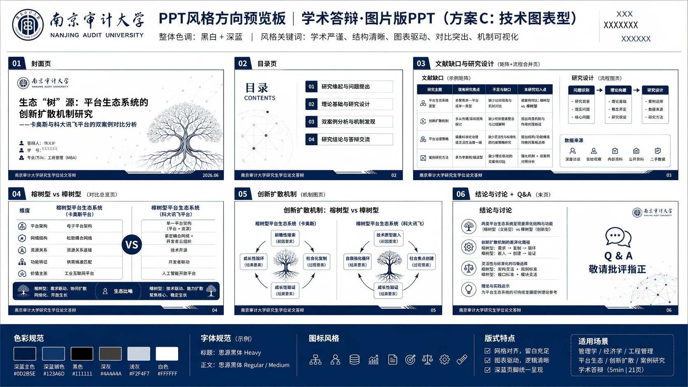
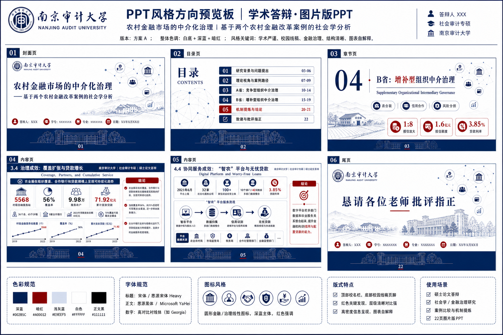

`academic-image-ppt` 是一个 Codex Skill，用于把论文、毕业论文、开题/答辩材料、研究报告或学术手稿整理成图片版学术 PPT。它的核心路线是：先生成一张张完整的 16:9 slide 图片，再把图片全页嵌入 PPTX。

它适合需要高质量视觉表达、严格遵守论文事实、并愿意先确认大纲和样页再批量生成的学术汇报场景。





> From academic source material to source-faithful image-based defense/report decks.

## 它解决什么问题？

很多学术 PPT 的难点不是“做几页漂亮模板”，而是把论文内容变成一套能讲清楚研究问题、方法、实验和结论的学术表达：

- 从 PDF、DOCX、论文正文或研究报告中提炼汇报结构。
- 把论文信息转成页级 `governing message` 和证据角色。
- 在生成图片前先确认 alignment、deck blueprint、缩略图风格和样页。
- 对中文、指标、公式、学校/作者信息、图表数值做高风险 QA。
- 最终交付 PNG 页面和每页一张全幅图片的 image-only PPTX。

## 准备环境
**需要GPT会员！！！需要GPT会员！！！需要GPT会员！！！**
1、需要从GPT官网下载最新版Codex桌面版，下载本skill；
2、每次生成新的PPT，先新建文件夹，启用一个新项目，在项目环境下生成ppt，以防无法有效管理文件。

## 如何触发？

把 skill 目录复制到你的 Codex skills 目录：

```powershell
# Windows PowerShell
New-Item -ItemType Directory -Force "$env:USERPROFILE\.codex\skills\academic-image-ppt" | Out-Null
Copy-Item -Recurse -Force .\skills\academic-image-ppt\* "$env:USERPROFILE\.codex\skills\academic-image-ppt"
```

```bash
# macOS / Linux
mkdir -p ~/.codex/skills/academic-image-ppt
cp -R ./skills/academic-image-ppt/. ~/.codex/skills/academic-image-ppt/
```

然后在 Codex 里这样触发：

```text
请使用 academic-image-ppt，把我上传的论文生成一套中文毕业答辩图片版 PPT。

目标受众：答辩委员会老师
汇报时长：15 分钟
学校/专业/导师/日期：按我提供的信息填写
风格：正式学术答辩，白底，蓝色为主色
输出格式：PNG + image-only PPTX

请先做目标对齐和 Deck Blueprint，不要直接生成图片。
PS:事实上并不需要严格按照此提示词进行，只需要指出利用这个skill并提供原材料即可（PDF或Word），**目标对齐环节**skill会与你进行**交互**，请提供给它**一切你认为必要的信息以及不需要体现的信息**（目标页数不会严格对齐，你可以给出，但是skill会自动按照设计适配度进行页数优化）
```

## 工作流

1. **目标对齐**：确认论文文件、汇报场景、受众、页数或时长、学校信息、作者信息、导师、日期、输出格式和风格偏好。
2. **内容抽取**：从论文或报告中整理 `Academic Input Pack`，保证中文文本没有乱码。
3. **蓝图设计**：生成页级 `Deck Blueprint`，包含标题、主信息、证据角色、视觉机会、来源证据和 QA 风险。
4. **蓝图确认**：等待用户确认或逐页修改，不确认不进入设计阶段。
5. **风格缩略图**：生成 3 个 thumbnail style variants，让用户选择视觉系统。【注意】此处由于PNG单张绘制信息太多的原因，缩略图中示例图相对于样板页而言较为简洁，并不代表最终页面布局，此处更多用来控制色调配置和整体观感。
6. **样页确认**：生成 1-2 页全尺寸样页，确认文字、图表、密度和风格继承。
7. **批量生成**：按已确认的蓝图和视觉 contract 逐页生成完整 slide 图片。
8. **质量检查**：制作 contact sheet，检查中文、数字、图表、页码、学校/作者信息和整体一致性。
9. **PPTX 打包**：把每张 PNG 作为单页全幅图片嵌入 PPTX，并验证页数和图片数量。

## 输出物

默认输出通常包含：

```text
image_pages/
  slide_01.png
  slide_02.png
qa/
  alignment-summary.md
  deck-blueprint.md
  thumbnail-style-contract.md
  contact-sheet.png
output/
  academic-image-ppt-image-only.pptx
```

PPTX 中每页是一张完整图片。它可以用于放映、替换整页图片或重新生成，但默认不能逐字编辑文本框。

## 适合 / 不适合

适合：

- 毕业答辩、开题答辩、中期检查、课程汇报、学术讲座。
- 从论文、报告、PDF、DOCX 或手稿生成图片版学术 PPT。
- 需要先确认大纲、风格缩略图和样页，再批量生成。
- 对中文、公式、学校信息、指标含义和图表数值要求较高的汇报。

不适合：

- 需要整套全对象原生可编辑 PPTX 的任务。
- 只想简单套模板或快速美化已有 PPT。
- 不愿意经过 alignment、blueprint、thumbnail、sample gate 的批量生成任务。
- 需要模型凭空补实验数据、引用、指标或学校信息的任务。

## 目录结构

```text
academic-image-ppt/
  README.md
  LICENSE
  skills/
    academic-image-ppt/
      SKILL.md
      agents/
      assets/
      references/
```

## FAQ

### 生成的 PPTX 能逐字修改吗？

默认不能。这个 skill 的交付路线是 image-only PPTX：每页是一张完整图片。需要改字、改数字或改图表时，建议回到蓝图、样页或单页 prompt 层重新生成。

### 为什么不能直接批量生成？

学术 PPT 对事实、术语、指标和图表含义很敏感。先确认蓝图、风格缩略图和样页，可以避免整套 deck 在结构、风格或文字质量上跑偏。

### 服务端错误导致生图失败如何解决？

由于Codex可能存在限流问题，会导致生图过程中偶尔出现“服务端错误”Error，不必担心，可以换时间生成，或任其尝试。

### 如何实现可编辑/修改？

由于**本skill高度依赖Openai的image 2.0模型**，因此在Codex中最为适配，其他agent或harness中并未试验，欢迎各种形式和方向的PR。正因此，也导致**只能生成PNG类型的图片PPT**，这可能会产生困扰。经过探寻，发现可以**进行编辑或简单修改的方式**有以下几种：
1、只需要小范围修改某些字————利用**WPS会员**的**图片编辑功能**，可以“**无痕改字**”，修改字数相似的情况下可以保留原有字体，方便快捷；
2、进行色调变换、字体修改————图片重绘，可以利用**豆包生图**进行修改；
3、用Codex的image gen技能重绘，注意小范围修改只改对应页即可；
4、先保存为PDF格式，再利用**WPS的PDF转PPT**（但是这种方式可能会造成要素大范围偏移，而且无法保证所有文字板块可以恢复成可编辑状态）；
5、利用另外一个repo："https://github.com/Pikapika260214/rw-consulting-ppt"
 下"ppt-to-editable"这个skill（尚未测试）。
